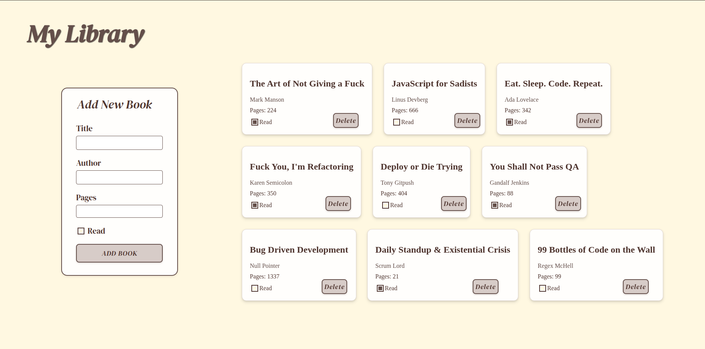

# My Library

A simple online library application to manage your book collection. Add books, track your reading progress, and remove books you no longer need.

## Features

- **Add Books**: Fill out the form to add new books to your library.
- **Track Reading Status**: Toggle the "Read" checkbox to mark books as read or unread.
- **Delete Books**: Remove books from your library with the delete button.
- **Responsive Design**: Clean and visually appealing interface with a responsive layout.

## Technologies Used

- **HTML5**: Structure of the web page.
- **CSS3**: Styling and animations, including custom fonts and responsive grids.
- **JavaScript**: Dynamic functionality for adding, tracking, and deleting books.

## How to Use

1. **Add a New Book**:

   - Fill in the title, author, and number of pages.
   - Check the "Read" box if you've already read the book.
   - Click the "Add Book" button to add it to your library.

2. **Update Reading Status**:

   - Toggle the checkbox next to "Read" to update the status of any book.

3. **Delete a Book**:
   - Click the "Delete" button on any book card to remove it from your library.

## Project Structure

- `index.html`: The main HTML file containing the structure of the application.
- `style.css`: The stylesheet for styling the application.
- `script.js`: The JavaScript file handling the dynamic functionality.
- `screenshot.png`: Preview image of the application (optional).

## Fonts

The application uses the **DM Serif Display** font for a classic and elegant look. The font files are loaded via `@font-face` in the CSS.
